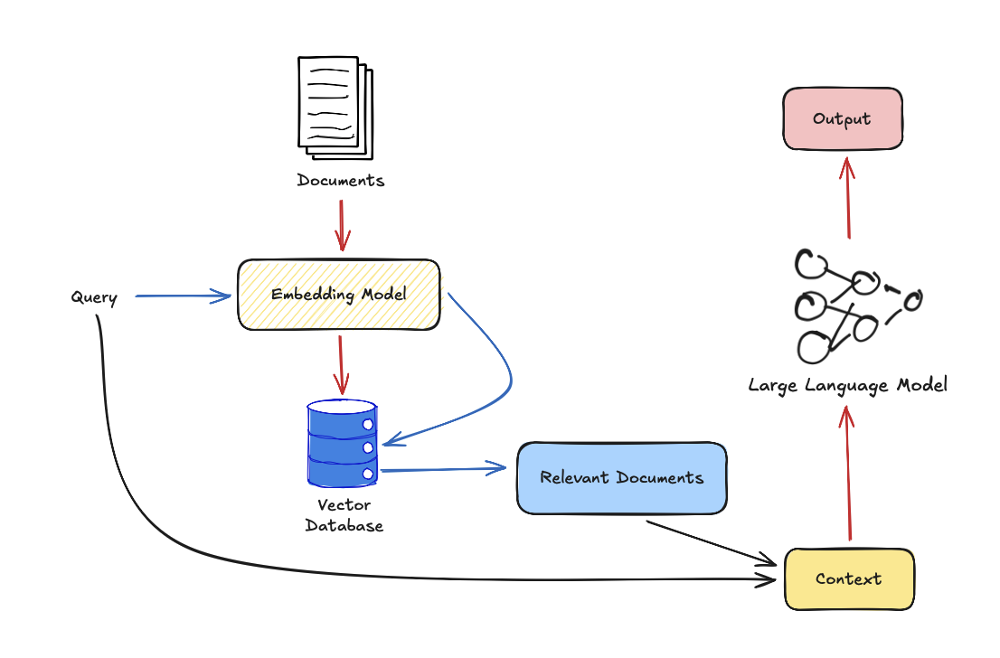

# Sơ lược về Cache-Augmented Generation (CAG)
Để xây dựng một hệ thống ứng dụng **Large Language Model**, chắc hẳn chúng ta sẽ phải áp dụng một vài kỹ thuật để tăng cường khả năng của mô hình, điển hình nhất là sử dụng những kỹ thuật về tăng cường truy xuất (**Retrieval Augmented Generation**). 

## RAG là gì
RAG là một kỹ thuật giúp cải thiện câu trả lời của các mô hình ngôn ngữ lớn, giảm thiểu tình trạng ảo giác (halluciation) bằng cách thêm những thông tin văn bản liên quan đến câu đầu vào từ một kho văn bản lớn bằng các kỹ thuật tìm kiếm.

Cách thức hoạt động có thể được mô tả như sau:

- Đầu tiên, bộ 

## CAG là gì

## CAG hoạt động như nào

## So sánh RAG và CAG

## Kết luận